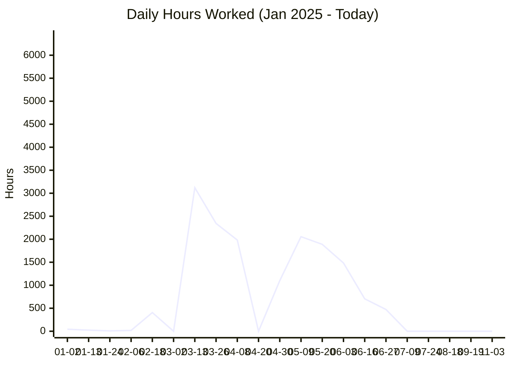
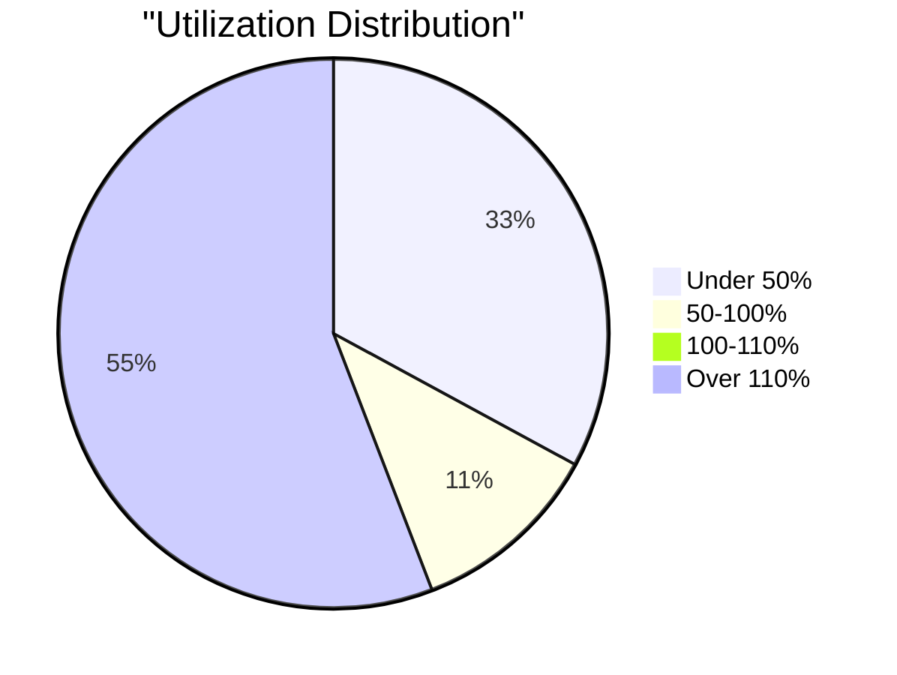

# SDP QC Data Report - 2025

> **Report Generated:** 2025-12-22 16:18:28  
> **Date Range:** 2025-01-02 to 2025-12-12  
> **Database:** `qc_cleaned_2025.db`

---

## 📊 Executive Summary

This report provides a comprehensive analysis of QC (Quality Control) data from January 2025 through today. All data has been cleaned, standardized, and organized for analysis.

---

## 📈 Overview Statistics

| Metric | Value |
|--------|-------|
| **Total QC Entries** | 3,018 |
| **Total Hours Worked** | 158,700.85 hours |
| **Total Parts Produced** | 471,186 |
| **Unique Operators** | 49 |
| **Unique Work Orders** | 255 |
| **Unique Customers** | 138 |
| **Days with Activity** | 189 |
| **Average Hours per Day** | 839.69 hours |
| **Average Parts per Entry** | 156.1 |

---

## 👥 Top Operators by Total Hours

| Operator | Entries | Total Hours | Total Parts | Days Worked | Avg Utilization | Last Work Date |
|----------|---------|-------------|-------------|-------------|-----------------|----------------|
| David | 440 | 19,780.32 | 91,854 | 128 | 1063.46% | 2025-08-18 |
| Ruth | 298 | 14,795.67 | 26,457 | 76 | 1060.62% | 2025-11-25 |
| Irma + Others | 40 | 13,346.50 | 4,205 | 31 | 7414.72% | 2025-08-13 |
| Rafael | 166 | 12,022.92 | 10,810 | 100 | 1313.98% | 2025-07-08 |
| Jesus | 199 | 11,741.78 | 49,641 | 87 | 1361.37% | 2025-07-24 |
| Bernardino + Others | 183 | 10,330.27 | 13,029 | 64 | 1363.73% | 2025-11-04 |
| Maria + Others | 65 | 10,073.50 | 363 | 37 | 7069.12% | 2025-07-29 |
| Filiberto + Others | 222 | 7,314.38 | 1,470 | 108 | 848.04% | 2025-10-31 |
| Evelyn | 121 | 5,843.12 | 48,130 | 51 | 1469.97% | 2025-11-17 |
| Mike Archer | 358 | 5,487.36 | 32,569 | 54 | 334.79% | 2025-03-28 |
| Gary | 58 | 4,372.61 | 4,178 | 49 | 1189.83% | 2025-11-24 |
| Bernardino | 216 | 4,059.16 | 7,115 | 80 | 660.03% | 2025-09-22 |
| Evelyn + Others | 29 | 3,583.34 | 54,640 | 24 | 4777.79% | 2025-09-16 |
| Irma | 40 | 3,004.41 | 1,168 | 30 | 1251.84% | 2025-05-15 |
| Larry + Others | 3 | 3,002.00 | N/A | 3 | 13342.22% | 2025-06-02 |
| Maria | 37 | 2,743.07 | 1,739 | 31 | 1219.14% | 2025-07-09 |
| Zeferino | 97 | 2,450.02 | 5,811 | 52 | 680.56% | 2025-11-05 |
| Zeferino + Others | 15 | 2,351.16 | 928 | 12 | 2849.89% | 2025-07-31 |
| Kaleb | 91 | 2,109.00 | 9,975 | 35 | 2163.08% | 2025-11-04 |
| Larry | 9 | 1,928.75 | 430 | 7 | 6429.17% | 2025-07-08 |

---

## 📋 Top Work Orders by Total Hours

| Work Order | Customer | Entries | Total Hours | Total Parts | Start Date | End Date |
|------------|---------|---------|-------------|-------------|------------|----------|
| 4500569295 | Curbell | 28 | 7,934.00 | 5,067 | 2025-05-13 | 2025-05-28 |
| 300096 | VCI | 25 | 7,651.00 | 2,675 | 2025-02-03 | 2025-04-23 |
| ML110824-B12 | Pack IQ | 115 | 7,312.00 | 8,843 | 2025-04-07 | 2025-08-13 |
| 61432 | Richfield | 30 | 7,013.00 | 16,529 | 2025-03-12 | 2025-06-03 |
| 406744 | Diamond Mfg | 31 | 6,692.00 | 3,140 | 2025-04-09 | 2025-04-16 |
| 406801 | Diamond Mfg of Bluffton | 39 | 6,450.00 | 6,583 | 2025-05-13 | 2025-06-20 |
| 2025132 | Lamar | 30 | 5,932.00 | 236 | 2025-04-02 | 2025-04-14 |
| 1082207 | Benchmark Ind | 22 | 5,025.00 | 9,445 | 2025-03-21 | 2025-04-22 |
| ML012125-A1 | Pack IQ | 22 | 4,399.00 | 719 | 2025-05-12 | 2025-05-28 |
| 406836 | Diamond Mfg of Bluffton | 32 | 3,897.00 | 2,981 | 2025-05-28 | 2025-06-12 |
| 729269 | Premier | 9 | 2,737.00 | 454 | 2025-05-27 | 2025-06-06 |
| ML021825-A1 | Pack IQ | 20 | 2,715.00 | 2,161 | 2025-06-04 | 2025-06-06 |
| 200200 | Steeltech | 10 | 2,674.00 | 1,507 | 2025-03-19 | 2025-04-23 |
| 820261 | Skybox | 4 | 2,562.00 | 50,000 | 2025-04-21 | 2025-04-30 |
| 406766 | Diamond | 16 | 2,104.00 | 1,690 | 2025-04-17 | 2025-04-25 |
| 68028 | Stephen Gould | 11 | 1,993.00 | 165 | 2025-05-01 | 2025-05-13 |
| 28220 | Nova | 21 | 1,862.00 | 2,109 | 2025-05-27 | 2025-07-01 |
| 135285 | Robin Ent | 19 | 1,703.00 | 209 | 2025-03-26 | 2025-04-18 |
| 182551 | TRG | 4 | 1,680.00 | 6,543 | 2025-04-30 | 2025-05-05 |
| MI100547 | VCI | 10 | 1,665.00 | 1,376 | 2025-06-11 | 2025-06-18 |

---

## 🏢 Top Customers by Total Hours

| Customer | Entries | Total Hours | Total Parts | Work Orders |
|----------|---------|-------------|-------------|-------------|
| Premier | 150 | 17,104.34 | 31,909 | 25 |
| Pack IQ | 235 | 16,273.00 | 13,488 | 13 |
| Richfield | 108 | 11,495.91 | 21,507 | 14 |
| VCI | 149 | 10,526.37 | 8,556 | 12 |
| Diamond Mfg of Bluffton | 124 | 10,347.00 | 11,722 | 3 |
| Curbell | 31 | 8,294.00 | 5,067 | 2 |
| Royal Group | 19 | 7,213.00 | 14,726 | 3 |
| Diamond Mfg | 31 | 6,692.00 | 3,140 | 1 |
| Lamar | 30 | 5,932.00 | 236 | 1 |
| Benchmark Ind | 22 | 5,025.00 | 9,445 | 1 |
| Stephen Gould | 85 | 4,933.74 | 6,665 | 13 |
| NOVA | 44 | 4,637.25 | 2,804 | 2 |
| KENWORTH | 20 | 4,218.00 | 1,730 | 0 |
| Steeltech | 38 | 3,439.00 | 1,669 | 5 |
| GE | 87 | 2,956.74 | 1,582 | 8 |
| Nova | 79 | 2,708.00 | 3,538 | 8 |
| Skybox | 4 | 2,562.00 | 50,000 | 1 |
| Diamond | 33 | 2,413.68 | 2,055 | 2 |
| TRG | 21 | 2,123.00 | 8,096 | 7 |
| Keystone | 27 | 2,121.00 | 273 | 2 |

---

## 🏭 Department Statistics

| Department | Entries | Total Hours | Total Parts | Operators | Avg Utilization |
|------------|---------|-------------|-------------|-----------|------------------|
| Assembly | 49 | 13,402.50 | 15,960 | 8 | 4155.81% |

---

## 📅 Daily Trends

### Daily Hours Worked

### Daily Summary (Last 30 Days)

| Date | Entries | Hours | Parts |
|------|---------|-------|-------|
| 2025-08-06 | 1 | N/A | 200 |
| 2025-08-12 | 5 | N/A | 18 |
| 2025-08-13 | 3 | 330.00 | 42 |
| 2025-08-18 | 2 | N/A | 1,216 |
| 2025-08-19 | 1 | N/A | N/A |
| 2025-08-21 | 1 | N/A | N/A |
| 2025-08-25 | 2 | N/A | N/A |
| 2025-09-08 | 2 | N/A | 271 |
| 2025-09-15 | 3 | N/A | 414 |
| 2025-09-16 | 2 | N/A | N/A |
| 2025-09-17 | 1 | N/A | 608 |
| 2025-09-18 | 19 | N/A | 182 |
| 2025-09-19 | 3 | N/A | 9 |
| 2025-09-22 | 3 | N/A | 18 |
| 2025-09-29 | 1 | N/A | 900 |
| 2025-10-02 | 2 | N/A | 400 |
| 2025-10-07 | 1 | N/A | 200 |
| 2025-10-13 | 2 | N/A | 1,700 |
| 2025-10-27 | 2 | N/A | 200 |
| 2025-10-30 | 7 | N/A | 539 |
| 2025-10-31 | 9 | N/A | 1,371 |
| 2025-11-03 | 19 | N/A | 2,090 |
| 2025-11-04 | 18 | N/A | 1,145 |
| 2025-11-05 | 4 | N/A | 78 |
| 2025-11-11 | 6 | N/A | 96 |
| 2025-11-13 | 2 | N/A | 32 |
| 2025-11-17 | 2 | N/A | 23 |
| 2025-11-24 | 2 | N/A | 50 |
| 2025-11-25 | 2 | N/A | 66 |
| 2025-12-12 | 1 | 1.75 | N/A |

---

## 📊 Utilization Distribution

| Utilization Range | Count | Percentage |
|-------------------|-------|------------|
| < 50% | 544 | 32.59% |
| 50-100% | 186 | 11.14% |
| 100-110% | 16 | 0.96% |
| > 110% | 923 | 55.30% |

---

## ✅ Yield Analysis

| Yield Status | Entries | Total Scrap | Total Defects | Total Parts |
|--------------|---------|-------------|---------------|-------------|
| 1 | 116 | N/A | N/A | 3,395 |
| 3 | 80 | N/A | N/A | 2,542 |
| 12 | 79 | N/A | N/A | 8,039 |
| 22 | 69 | N/A | N/A | 4,958 |
| 6 | 64 | N/A | N/A | 2,432 |
| 2 | 52 | N/A | N/A | 1,636 |
| 4 | 42 | N/A | N/A | 1,253 |
| 8 | 40 | N/A | N/A | 52,406 |
| 36 | 40 | N/A | N/A | 2,747 |
| 10 | 36 | N/A | N/A | 763 |
| 9 | 35 | N/A | N/A | 21,211 |
| 20 | 35 | N/A | N/A | 1,890 |
| 18 | 34 | N/A | N/A | 846 |
| 16 | 34 | N/A | N/A | 2,919 |
| 11 | 33 | N/A | N/A | 2,136 |
| SCRAP | 31 | 31 | N/A | 7,473 |
| 17 | 29 | N/A | N/A | 1,293 |
| X | 25 | N/A | N/A | 5,711 |
| 15 | 21 | N/A | N/A | 716 |
| 30 | 20 | N/A | N/A | 2,676 |
| 144 | 20 | N/A | N/A | 1,977 |
| 7 | 19 | N/A | N/A | 1,232 |
| 100 | 19 | N/A | N/A | 1,800 |
| 26 | 18 | N/A | N/A | 2,596 |
|   | 17 | N/A | N/A | N/A |
| 75 | 17 | N/A | N/A | 6,461 |
| 14 | 17 | N/A | N/A | 5,568 |
| 21 | 16 | N/A | N/A | 1,408 |
| 80 | 15 | N/A | N/A | 2,533 |
| 25 | 14 | N/A | N/A | 648 |
| 50 | 13 | N/A | N/A | 2,111 |
| 35 | 13 | N/A | N/A | 393 |
| 13 | 13 | N/A | N/A | 482 |
| 5 | 12 | N/A | N/A | 273 |
| 150 | 12 | N/A | N/A | 1,900 |
| 72 | 11 | N/A | N/A | 2,012 |
| 40 | 11 | N/A | N/A | 1,282 |
| 84 | 10 | N/A | N/A | 7,873 |
| 54 | 10 | N/A | N/A | 1,126 |
| 28 | 10 | N/A | N/A | 2,728 |
| 27 | 10 | N/A | N/A | 770 |
| 24 | 10 | N/A | N/A | 5,384 |
| 64 | 9 | N/A | N/A | 2,458 |
| 94 | 8 | N/A | N/A | 1,151 |
| 61 | 8 | N/A | N/A | 606 |
| 506 | 8 | N/A | N/A | 384 |
| 52 | 7 | N/A | N/A | 540 |
| 46 | 7 | N/A | N/A | 780 |
| 360 | 7 | N/A | N/A | 3,551 |
| 304 | 7 | N/A | N/A | 6,043 |
| 288 | 7 | N/A | N/A | 16,794 |
| 70 | 6 | N/A | N/A | 92 |
| 60 | 6 | N/A | N/A | 1,242 |
| 520 | 6 | N/A | N/A | 2,490 |
| 47 | 6 | N/A | N/A | 40 |
| 450 | 6 | N/A | N/A | 96 |
| 32 | 6 | N/A | N/A | 4,258 |
| 19 | 6 | N/A | N/A | 617 |
| 1776 | 6 | N/A | N/A | 17,000 |
| 110 | 6 | N/A | N/A | 750 |
| 66 | 5 | N/A | N/A | 674 |
| 48 | 5 | N/A | N/A | 319 |
| 38 | 5 | N/A | N/A | 1,618 |
| 294 | 5 | N/A | N/A | 1,100 |
| 2 PCS. | 5 | N/A | N/A | N/A |
| >16 | 4 | N/A | N/A | 240 |
| 96 | 4 | N/A | N/A | 880 |
| 92 | 4 | N/A | N/A | 514 |
| 9 PCS | 4 | N/A | N/A | 106 |
| 44 | 4 | N/A | N/A | 632 |
| 396 | 4 | N/A | N/A | 92 |
| 3504 | 4 | N/A | N/A | 5,080 |
| 20 PCS. | 4 | N/A | N/A | N/A |
| 128 | 4 | N/A | N/A | 50,000 |
| 115 | 4 | N/A | N/A | 2,160 |
| 97 | 3 | N/A | N/A | 360 |
| 90 | 3 | N/A | N/A | 2,867 |
| 84 PCS | 3 | N/A | N/A | N/A |
| 8 PCS. | 3 | N/A | N/A | 151 |
| 775 | 3 | N/A | N/A | 11,602 |
| 690 | 3 | N/A | N/A | 48 |
| 55 | 3 | N/A | N/A | 1,880 |
| 51 | 3 | N/A | N/A | 802 |
| 49 | 3 | N/A | N/A | 134 |
| 43 | 3 | N/A | N/A | 84 |
| 42 | 3 | N/A | N/A | 4,346 |
| 4 PCS | 3 | N/A | N/A | 320 |
| 39 | 3 | N/A | N/A | 360 |
| 382 | 3 | N/A | N/A | 1,490 |
| 37 | 3 | N/A | N/A | 118 |
| 363 | 3 | N/A | N/A | N/A |
| 313 | 3 | N/A | N/A | 3,116 |
| 31 | 3 | N/A | N/A | 88 |
| 29 | 3 | N/A | N/A | 418 |
| 264 | 3 | N/A | N/A | 320 |
| 192 | 3 | N/A | N/A | 372 |
| 160 | 3 | N/A | N/A | 362 |
| 16 PCS | 3 | N/A | N/A | N/A |
| 135 | 3 | N/A | N/A | 20 |
| 1200 | 3 | N/A | N/A | 2,202 |
| 108 | 3 | N/A | N/A | 88 |
| 85 | 2 | N/A | N/A | 6 |
| 78 | 2 | N/A | N/A | 234 |
| 74 | 2 | N/A | N/A | 72 |
| 68 | 2 | N/A | N/A | 240 |
| 63 | 2 | N/A | N/A | 40 |
| 62 | 2 | N/A | N/A | N/A |
| 595 | 2 | N/A | N/A | N/A |
| 56 | 2 | N/A | N/A | 93 |
| 530 | 2 | N/A | N/A | 2,490 |
| 53 | 2 | N/A | N/A | 413 |
| 465 | 2 | N/A | N/A | N/A |
| 430 | 2 | N/A | N/A | 774 |
| 4 PCS. | 2 | N/A | N/A | 80 |
| 38+ | 2 | N/A | N/A | 96 |
| 368 | 2 | N/A | N/A | 230 |
| 34 | 2 | N/A | N/A | 683 |
| 33 | 2 | N/A | N/A | 422 |
| 329 | 2 | N/A | N/A | 168 |
| 322 | 2 | N/A | N/A | 690 |
| 314 | 2 | N/A | N/A | 709 |
| 312 | 2 | N/A | N/A | 772 |
| 3 PCS, | 2 | N/A | N/A | N/A |
| 288PCS | 2 | N/A | N/A | 3,456 |
| 2304 | 2 | N/A | N/A | 505 |
| 23 | 2 | N/A | N/A | 198 |
| 200 | 2 | N/A | N/A | 400 |
| 180 | 2 | N/A | N/A | 228 |
| 1722 | 2 | N/A | N/A | 505 |
| 156 | 2 | N/A | N/A | 156 |
| 138 | 2 | N/A | N/A | 370 |
| 1368 | 2 | N/A | N/A | 2,128 |
| 136 | 2 | N/A | N/A | 6 |
| 132 | 2 | N/A | N/A | 264 |
| 126 PCS. | 2 | N/A | N/A | N/A |
| 114 PCS. | 2 | N/A | N/A | N/A |
| 104 | 2 | N/A | N/A | 231 |
|   | 2 | N/A | N/A | 81 |
| TOOK LONGER TO PAINT CAUSE OF THE CUT | 1 | N/A | N/A | N/A |
| TOOK 1 HOUR TO CLEAN PARTS | 1 | N/A | N/A | N/A |
| PART B AND A | 1 | N/A | N/A | 18 |
| DEFECT | 1 | N/A | 6 | N/A |
| 984 | 1 | N/A | N/A | 660 |
| 936 | 1 | N/A | N/A | 1,248 |
| 92 PCS. | 1 | N/A | N/A | N/A |
| 91 | 1 | N/A | N/A | N/A |
| 8PCS | 1 | N/A | N/A | N/A |
| 88 | 1 | N/A | N/A | 88 |
| 87 | 1 | N/A | N/A | 30 |
| 86 | 1 | N/A | N/A | 86 |
| 80PCS | 1 | N/A | N/A | N/A |
| 8 SHEETS | 1 | N/A | N/A | N/A |
| 77 | 1 | N/A | N/A | 22 |
| 76 | 1 | N/A | N/A | 72 |
| 7015 | 1 | N/A | N/A | N/A |
| 7 SETS | 1 | N/A | N/A | N/A |
| 65 | 1 | N/A | N/A | N/A |
| 648 | 1 | N/A | N/A | 7,500 |
| 6 PER STRIP | 1 | N/A | N/A | 300 |
| 6 PARTS | 1 | N/A | N/A | N/A |
| 58 | 1 | N/A | N/A | 400 |
| 57 | 1 | N/A | N/A | 173 |
| 52PCS | 1 | N/A | N/A | N/A |
| 5 PCS. | 1 | N/A | N/A | N/A |
| 490 | 1 | N/A | N/A | 3 |
| 480 | 1 | N/A | N/A | 400 |
| 45+ | 1 | N/A | N/A | 45 |
| 445 | 1 | N/A | N/A | N/A |
| 437 | 1 | N/A | N/A | 1,080 |
| 4 SHEETS | 1 | N/A | N/A | N/A |
| 4 PER | 1 | N/A | N/A | N/A |
| 380 | 1 | N/A | N/A | 380 |
| 36 PCS | 1 | N/A | N/A | N/A |
| 35 PCS | 1 | N/A | N/A | N/A |
| 320 | 1 | N/A | N/A | 320 |
| 32 PER STRIP | 1 | N/A | N/A | N/A |
| 32 PER | 1 | N/A | N/A | N/A |
| 302 | 1 | N/A | N/A | 3 |
| 30 PCS | 1 | N/A | N/A | N/A |
| 3 PCS. | 1 | N/A | N/A | 6 |
| 282 | 1 | N/A | N/A | 397 |
| 28/21 | 1 | N/A | N/A | 84 |
| 2700 | 1 | N/A | N/A | N/A |
| 25PCS | 1 | N/A | N/A | N/A |
| 256 | 1 | N/A | N/A | N/A |
| 252 | 1 | N/A | N/A | 180 |
| 24 SHEETS | 1 | N/A | N/A | N/A |
| 24 & 12 | 1 | N/A | N/A | 282 |
| 230 | 1 | N/A | N/A | 318 |
| 22 EACH | 1 | N/A | N/A | 22 |
| 210PCS | 1 | N/A | N/A | N/A |
| 210 | 1 | N/A | N/A | N/A |
| 207 | 1 | N/A | N/A | 207 |
| 200PCS | 1 | N/A | N/A | N/A |
| 20-24 | 1 | N/A | N/A | 215 |
| 20 PCDS. | 1 | N/A | N/A | N/A |
| 197 | 1 | N/A | N/A | N/A |
| 1900-01-01 00:00:00 | 1 | N/A | N/A | N/A |
| 182 | 1 | N/A | N/A | 182 |
| 18 PCS. | 1 | N/A | N/A | N/A |
| 1770 | 1 | N/A | N/A | 5,500 |
| 175 | 1 | N/A | N/A | 600 |
| 170 | 1 | N/A | N/A | 366 |
| 16/24/6 | 1 | N/A | N/A | N/A |
| 16 PER SHEET | 1 | N/A | N/A | N/A |
| 16 PCS. | 1 | N/A | N/A | N/A |
| 158 | 1 | N/A | N/A | 158 |
| 1560 | 1 | N/A | N/A | 2,000 |
| 154 | 1 | N/A | N/A | 48 |
| 152 | 1 | N/A | N/A | 400 |
| 1512 | 1 | N/A | N/A | 1,512 |
| 1480 | 1 | N/A | N/A | 6,488 |
| 144 PCS | 1 | N/A | N/A | 1,008 |
| 126 | 1 | N/A | N/A | 76 |
| 123PCS | 1 | N/A | N/A | N/A |
| 1225 | 1 | N/A | N/A | 3,900 |
| 121 | 1 | N/A | N/A | N/A |
| 120 | 1 | N/A | N/A | N/A |
| 12 PCS | 1 | N/A | N/A | 1,056 |
| 117+ | 1 | N/A | N/A | 96 |
| 1152 | 1 | N/A | N/A | 76 |
| 11 SHEETS | 1 | N/A | N/A | N/A |
| 106 | 1 | N/A | N/A | 12 |
| 1056 | 1 | N/A | N/A | 2,500 |
| 105 | 1 | N/A | N/A | 22 |
| 10 PCS. | 1 | N/A | N/A | N/A |
| 10 PCS | 1 | N/A | N/A | N/A |
| 10 PARTS | 1 | N/A | N/A | N/A |
| 1 PER SHEER | 1 | N/A | N/A | 60 |
| 1 PC OF EACH | 1 | N/A | N/A | N/A |

**Overall Scrap Rate:** 0.01%

**Overall Defect Rate:** 0.00%

---

## 👥 Individual Employee Reports

Individual reports have been generated for each employee. See the [[Employees|Employees]] page for links to individual reports.

---

## 📝 Notes

- All times are in hours unless otherwise specified
- Utilization is calculated based on 450-minute (7.5 hour) standard shift
- Operator names have been standardized from various formats found in QC sheets
- Data includes entries from January 1, 2025 through today

---

*Report generated automatically from cleaned QC database*

