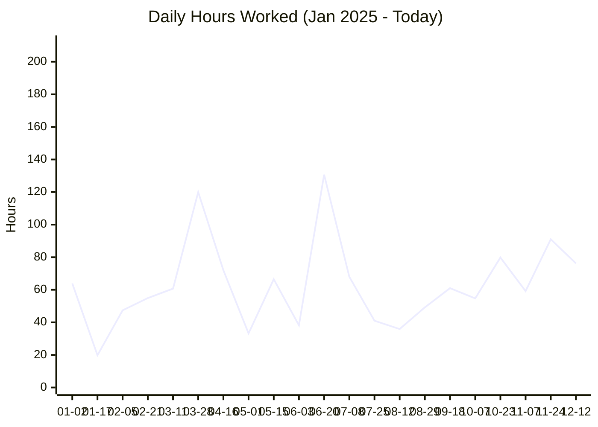
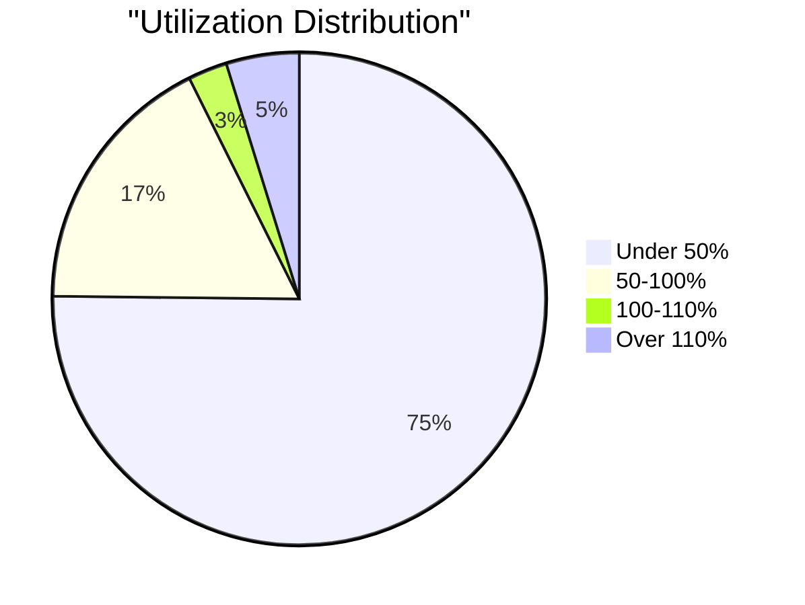

# SDP QC Data Report - 2025

> **Report Generated:** 2025-12-23 14:21:21  
> **Date Range:** 2025-01-02 to 2025-12-23  
> **Database:** `qc_cleaned_2025.db`

---

## 📊 Executive Summary

This report provides a comprehensive analysis of QC (Quality Control) data from January 2025 through today. All data has been cleaned, standardized, and organized for analysis.

---

## 📈 Overview Statistics

| Metric | Value |
|--------|-------|
| **Total QC Entries** | 6,361 |
| **Total Hours Worked** | 16,137.70 hours |
| **Total Parts Produced** | 1,337,597 |
| **Unique Operators** | 48 |
| **Unique Work Orders** | 635 |
| **Unique Customers** | 211 |
| **Days with Activity** | 268 |
| **Average Hours per Day** | 60.22 hours |
| **Average Parts per Entry** | 210.3 |

---

## 👥 Top Operators by Total Hours

| Operator | Entries | Total Hours | Total Parts | Days Worked | Avg Utilization | Last Work Date |
|----------|---------|-------------|-------------|-------------|-----------------|----------------|
| David | 711 | 2,298.75 | 119,295 | 174 | 46.02% | 2025-12-23 |
| Ruth | 476 | 1,438.17 | 46,731 | 184 | 41.72% | 2025-12-23 |
| Bernie | 631 | 919.31 | 52,994 | 196 | 23.89% | 2025-12-19 |
| Joe | 494 | 837.50 | 80,250 | 76 | 24.04% | 2025-12-19 |
| Mike Archer | 358 | 701.16 | 32,569 | 54 | 26.82% | 2025-03-28 |
| Jesus | 199 | 695.65 | 52,508 | 97 | 50.46% | 2025-12-22 |
| Gary | 152 | 633.23 | 15,002 | 115 | 58.63% | 2025-12-23 |
| Zulema | 225 | 583.15 | 36,694 | 117 | 37.03% | 2025-12-23 |
| Filiberto + Others | 223 | 544.20 | 1,558 | 109 | 32.98% | 2025-10-31 |
| Bernie + Others | 182 | 539.90 | 12,964 | 63 | 43.11% | 2025-11-04 |
| Evelyn | 298 | 538.15 | 195,258 | 133 | 25.90% | 2025-12-17 |
| Rafael | 166 | 531.55 | 10,810 | 100 | 42.95% | 2025-07-08 |
| Carolina | 181 | 486.08 | 25,293 | 93 | 37.03% | 2025-12-18 |
| Filiberto | 183 | 339.50 | 8,613 | 93 | 25.15% | 2025-12-17 |
| Kaleb | 143 | 331.70 | 19,923 | 56 | 32.05% | 2025-11-19 |
| Zeferino | 144 | 327.30 | 96,766 | 85 | 36.67% | 2025-12-23 |
| Marissa | 123 | 274.17 | 78,263 | 51 | 31.24% | 2025-11-10 |
| Irma + Others | 40 | 226.02 | 4,205 | 31 | 120.54% | 2025-08-13 |
| Juana | 85 | 207.17 | 14,705 | 42 | 33.28% | 2025-12-23 |
| Maria | 74 | 200.99 | 2,234 | 50 | 40.60% | 2025-07-29 |

---

## 📋 Top Work Orders by Total Hours

| Work Order | Customer | Entries | Total Hours | Total Parts | Start Date | End Date |
|------------|---------|---------|-------------|-------------|------------|----------|
| ML110824-B12 | Pack IQ | 116 | 489.72 | 8,865 | 2025-04-07 | 2025-08-13 |
| 26752 | Precision MHE | 114 | 474.75 | 11,456 | 2025-10-10 | 2025-12-22 |
| 300484 | Basin SC | 112 | 331.75 | 16,343 | 2025-08-19 | 2025-10-28 |
| 754898 | Premier | 50 | 256.50 | 31,210 | 2025-12-11 | 2025-12-18 |
| MI101189 | VCI | 55 | 231.25 | 7,459 | 2025-11-10 | 2025-12-12 |
| 2442 | Morrison | 50 | 198.25 | 3,384 | 2025-10-16 | 2025-11-03 |
| 2025132 | Lamar | 30 | 197.20 | 236 | 2025-04-02 | 2025-04-14 |
| 407026 | Diamond | 39 | 180.25 | 9,505 | 2025-09-10 | 2025-12-23 |
| 406801 | Diamond Mfg of Bluffton | 40 | 179.92 | 6,583 | 2025-05-13 | 2025-06-20 |
| 300096 | VCI | 25 | 167.83 | 2,675 | 2025-02-03 | 2025-04-23 |
| 61432 | Richfield | 30 | 162.12 | 16,529 | 2025-03-12 | 2025-06-03 |
| 406794 | Diamond Mfg of Bluffton | 53 | 158.58 | 2,158 | 2025-05-06 | 2025-07-15 |
| 406750 | Diamond | 34 | 158.12 | 3,744 | 2025-04-28 | 2025-09-02 |
| 4500569295 | Curbell | 28 | 155.83 | 5,067 | 2025-05-13 | 2025-05-28 |
| 300183 | VCI-SC | 20 | 149.82 | 528 | 2025-04-28 | 2025-05-07 |
| 092524 | COF | 58 | 130.00 | 4,163 | 2025-03-11 | 2025-11-14 |
| ML050925-B1 | Pack IQ | 40 | 127.50 | 11,257 | 2025-11-10 | 2025-11-26 |
| 406744 | Diamond Mfg | 31 | 126.28 | 3,140 | 2025-04-09 | 2025-04-16 |
| 300122 | VCI | 42 | 125.10 | 1,878 | 2025-04-15 | 2025-05-15 |
| 748826 | Premier | 34 | 115.75 | 10,024 | 2025-10-23 | 2025-10-31 |

---

## 🏢 Top Customers by Total Hours

| Customer | Entries | Total Hours | Total Parts | Work Orders |
|----------|---------|-------------|-------------|-------------|
| Premier | 611 | 1,657.44 | 230,452 | 81 |
| Pack IQ | 333 | 1,116.47 | 35,228 | 22 |
| VCI | 276 | 765.05 | 23,221 | 26 |
| JJJ | 139 | 590.72 | 7,169 | 6 |
| Basin SC | 202 | 538.60 | 23,371 | 9 |
| Richfield | 171 | 509.50 | 27,289 | 30 |
| Precision MHE | 136 | 489.00 | 11,675 | 4 |
| Diamond Mfg of Bluffton | 140 | 479.07 | 15,901 | 4 |
| GE | 176 | 461.71 | 5,470 | 17 |
| Diamond | 115 | 446.58 | 15,381 | 7 |
| Morrison | 129 | 430.25 | 9,416 | 7 |
| Stephen Gould | 213 | 400.65 | 14,063 | 30 |
| TRG | 108 | 340.80 | 148,642 | 33 |
| Royal Group | 53 | 273.13 | 35,893 | 5 |
| Lamar | 61 | 251.95 | 843 | 2 |
| Honda | 60 | 247.25 | 11,128 | 0 |
| Nova | 172 | 240.00 | 6,349 | 20 |
| IZA | 107 | 238.52 | 4,101 | 12 |
| PREMIER | 81 | 234.13 | 41,446 | 4 |
| Steeltech | 111 | 197.07 | 5,538 | 18 |

---

## 🏭 Department Statistics

| Department | Entries | Total Hours | Total Parts | Operators | Avg Utilization |
|------------|---------|-------------|-------------|-----------|------------------|
| Assembly | 80 | 490.82 | 19,740 | 15 | 83.90% |
| Router | 180 | 338.75 | 8,581 | 1 | 25.52% |

---

## 📅 Daily Trends

### Daily Hours Worked

### Daily Summary (Last 30 Days)

| Date | Entries | Hours | Parts |
|------|---------|-------|-------|
| 2025-11-13 | 24 | 74.75 | 4,109 |
| 2025-11-14 | 33 | 98.75 | 8,500 |
| 2025-11-15 | 12 | 35.25 | 4,778 |
| 2025-11-17 | 38 | 89.83 | 4,352 |
| 2025-11-18 | 25 | 89.75 | 3,367 |
| 2025-11-19 | 14 | 65.75 | 11,095 |
| 2025-11-20 | 27 | 73.25 | 7,024 |
| 2025-11-21 | 24 | 58.00 | 7,347 |
| 2025-11-22 | 10 | 33.50 | 5,118 |
| 2025-11-24 | 31 | 91.00 | 7,815 |
| 2025-11-25 | 39 | 60.17 | 6,768 |
| 2025-11-26 | 38 | 65.50 | 5,624 |
| 2025-12-01 | 31 | 70.00 | 13,402 |
| 2025-12-02 | 39 | 89.50 | 3,819 |
| 2025-12-03 | 40 | 82.00 | 4,180 |
| 2025-12-04 | 34 | 102.00 | 4,415 |
| 2025-12-05 | 23 | 64.50 | 4,578 |
| 2025-12-06 | 8 | 19.25 | 1,168 |
| 2025-12-08 | 25 | 102.00 | 3,397 |
| 2025-12-09 | 32 | 124.00 | 7,616 |
| 2025-12-10 | 33 | 91.00 | 7,654 |
| 2025-12-11 | 29 | 90.75 | 7,822 |
| 2025-12-12 | 20 | 76.25 | 7,483 |
| 2025-12-15 | 29 | 89.50 | 8,506 |
| 2025-12-16 | 24 | 116.25 | 11,271 |
| 2025-12-17 | 23 | 100.25 | 11,330 |
| 2025-12-18 | 39 | 71.75 | 4,640 |
| 2025-12-19 | 20 | 43.75 | 9,473 |
| 2025-12-22 | 21 | 46.00 | 2,039 |
| 2025-12-23 | 15 | 17.50 | 1,132 |

---

## 📊 Utilization Distribution

| Utilization Range | Count | Percentage |
|-------------------|-------|------------|
| < 50% | 4,367 | 75.18% |
| 50-100% | 1,015 | 17.47% |
| 100-110% | 149 | 2.56% |
| > 110% | 278 | 4.79% |

---

## ✅ Yield Analysis

| Yield Status | Entries | Total Scrap | Total Defects | Total Parts |
|--------------|---------|-------------|---------------|-------------|
| 1 | 164 | N/A | N/A | 5,039 |
| 12 | 156 | N/A | N/A | 15,879 |
| 6 | 154 | N/A | N/A | 7,126 |
| 3 | 121 | N/A | N/A | 3,621 |
| 9 | 113 | N/A | N/A | 40,991 |
| 2 | 106 | N/A | N/A | 2,981 |
| 22 | 89 | N/A | N/A | 6,341 |
| 10 | 84 | N/A | N/A | 6,095 |
| 4 | 80 | N/A | N/A | 3,977 |
| 28 | 77 | N/A | N/A | 10,399 |
| 8 | 76 | N/A | N/A | 55,150 |
| 16 | 74 | N/A | N/A | 6,086 |
| 20 | 70 | N/A | N/A | 4,750 |
| SCRAP | 65 | 88 | N/A | 14,408 |
| 30 | 57 | N/A | N/A | 4,368 |
| 18 | 52 | N/A | N/A | 2,711 |
| 36 | 48 | N/A | N/A | 7,669 |
| 5 | 46 | N/A | N/A | 3,537 |
| 144 | 41 | N/A | N/A | 120,786 |
| 15 | 39 | N/A | N/A | 11,199 |
| 11 | 38 | N/A | N/A | 2,579 |
| 7 | 36 | N/A | N/A | 2,322 |
| 17 | 36 | N/A | N/A | 1,625 |
| 14 | 36 | N/A | N/A | 6,494 |
| X | 31 | N/A | N/A | 13,561 |
| 35 | 31 | N/A | N/A | 3,877 |
| 24 | 31 | N/A | N/A | 9,036 |
| 21 | 30 | N/A | N/A | 3,292 |
| 27 | 27 | N/A | N/A | 2,162 |
| 55 | 26 | N/A | N/A | 4,260 |
| 13 | 24 | N/A | N/A | 1,350 |
| 26 | 23 | N/A | N/A | 2,811 |
| 50 | 22 | N/A | N/A | 3,906 |
| 25 | 22 | N/A | N/A | 805 |
| 100 | 22 | N/A | N/A | 1,960 |
| 80 | 21 | N/A | N/A | 3,125 |
| 75 | 21 | N/A | N/A | 8,365 |
| 54 | 21 | N/A | N/A | 2,373 |
| 156 | 21 | N/A | N/A | 17,616 |
| 84 | 20 | N/A | N/A | 13,766 |
| 48 | 19 | N/A | N/A | 1,419 |
| 40 | 18 | N/A | N/A | 6,242 |
|   | 17 | N/A | N/A | N/A |
| N/A | 17 | N/A | N/A | 250 |
| 60 | 17 | N/A | N/A | 3,558 |
| 90 | 15 | N/A | N/A | 5,331 |
| 78 | 15 | N/A | N/A | 2,590 |
| 61 | 15 | N/A | N/A | 1,393 |
| 396 | 15 | N/A | N/A | 3,709 |
| 32 | 15 | N/A | N/A | 5,509 |
| 272 | 15 | N/A | N/A | 4,333 |
| 72 | 14 | N/A | N/A | 4,540 |
| 52 | 14 | N/A | N/A | 619 |
| 46 | 13 | N/A | N/A | 964 |
| 150 | 13 | N/A | N/A | 1,900 |
| 145 | 13 | N/A | N/A | 1,285 |
| 1275 | 13 | N/A | N/A | 30,300 |
| 23 | 12 | N/A | N/A | 439 |
| 132 | 12 | N/A | N/A | 1,748 |
| 70 | 11 | N/A | N/A | 1,102 |
| 64 | 11 | N/A | N/A | 2,970 |
| 38 | 11 | N/A | N/A | 1,897 |
| 360 | 11 | N/A | N/A | 30,431 |
| 304 | 11 | N/A | N/A | 7,265 |
| 288 | 11 | N/A | N/A | 46,192 |
| 29 | 10 | N/A | N/A | 736 |
| 96 | 9 | N/A | N/A | 9,173 |
| 94 | 9 | N/A | N/A | 1,167 |
| 92 | 9 | N/A | N/A | 890 |
| 66 | 9 | N/A | N/A | 994 |
| 238 | 9 | N/A | N/A | 2,139 |
| 19 | 9 | N/A | N/A | 786 |
| 110 | 9 | N/A | N/A | 1,060 |
| 56 | 8 | N/A | N/A | 187 |
| 51 | 8 | N/A | N/A | 997 |
| 506 | 8 | N/A | N/A | 384 |
| 44 | 8 | N/A | N/A | 1,633 |
| 42 | 8 | N/A | N/A | 5,992 |
| 34 | 8 | N/A | N/A | 5,087 |
| 136 | 8 | N/A | N/A | 326 |
| 120 | 8 | N/A | N/A | 414 |
| 43 | 7 | N/A | N/A | 1,216 |
| 37 | 7 | N/A | N/A | 868 |
| 135 | 7 | N/A | N/A | 64 |
| 888 | 6 | N/A | N/A | 10,048 |
| 63 | 6 | N/A | N/A | 134 |
| 520 | 6 | N/A | N/A | 2,490 |
| 47 | 6 | N/A | N/A | 40 |
| 450 | 6 | N/A | N/A | 96 |
| 45 | 6 | N/A | N/A | 397 |
| 33 | 6 | N/A | N/A | 845 |
| 312 | 6 | N/A | N/A | 1,110 |
| 31 | 6 | N/A | N/A | 100 |
| 192 | 6 | N/A | N/A | 2,034 |
| 1776 | 6 | N/A | N/A | 17,000 |
| 1610 | 6 | N/A | N/A | 13,348 |
| 99 | 5 | N/A | N/A | 1,386 |
| 65 | 5 | N/A | N/A | 630 |
| 49 | 5 | N/A | N/A | 567 |
| 47-49 | 5 | N/A | N/A | 2,084 |
| 329 | 5 | N/A | N/A | 505 |
| 294 | 5 | N/A | N/A | 1,100 |
| 200 | 5 | N/A | N/A | 927 |
| 2 PCS. | 5 | N/A | N/A | N/A |
| 121 | 5 | N/A | N/A | 96 |
| >16 | 4 | N/A | N/A | 240 |
| 9 PCS | 4 | N/A | N/A | 106 |
| 68 | 4 | N/A | N/A | 540 |
| 6 HALF 12 FULL | 4 | N/A | N/A | 504 |
| 39 | 4 | N/A | N/A | 368 |
| 368 | 4 | N/A | N/A | 450 |
| 3504 | 4 | N/A | N/A | 5,080 |
| 30+FALL | 4 | N/A | N/A | 575 |
| 271 | 4 | N/A | N/A | 300 |
| 264 | 4 | N/A | N/A | 584 |
| 20 PCS. | 4 | N/A | N/A | N/A |
| 180 | 4 | N/A | N/A | 728 |
| 1728 | 4 | N/A | N/A | 18,700 |
| 162 | 4 | N/A | N/A | 2,473 |
| 16 PER ROLL | 4 | N/A | N/A | 0 |
| 128 | 4 | N/A | N/A | 50,000 |
| 1152 | 4 | N/A | N/A | 2,726 |
| 115 | 4 | N/A | N/A | 2,160 |
| 108 | 4 | N/A | N/A | 188 |
| 104 | 4 | N/A | N/A | 241 |
| 97 | 3 | N/A | N/A | 360 |
| 936 | 3 | N/A | N/A | 1,256 |
| 84 PCS | 3 | N/A | N/A | N/A |
| 8 PCS. | 3 | N/A | N/A | 151 |
| 775 | 3 | N/A | N/A | 11,602 |
| 74 | 3 | N/A | N/A | 92 |
| 690 | 3 | N/A | N/A | 48 |
| 69 | 3 | N/A | N/A | 628 |
| 53 | 3 | N/A | N/A | 480 |
| 465 | 3 | N/A | N/A | 5 |
| 430 | 3 | N/A | N/A | 1,278 |
| 4 PCS | 3 | N/A | N/A | 320 |
| 382 | 3 | N/A | N/A | 1,490 |
| 378 | 3 | N/A | N/A | 355 |
| 363 | 3 | N/A | N/A | N/A |
| 322 | 3 | N/A | N/A | 1,169 |
| 32 COMMON LINE | 3 | N/A | N/A | 1,008 |
| 313 | 3 | N/A | N/A | 3,116 |
| 224 | 3 | N/A | N/A | 486 |
| 221 | 3 | N/A | N/A | 3,167 |
| 220 | 3 | N/A | N/A | 210 |
| 210 | 3 | N/A | N/A | 410 |
| 168 | 3 | N/A | N/A | 444 |
| 160 | 3 | N/A | N/A | 362 |
| 16 PCS | 3 | N/A | N/A | N/A |
| 152 | 3 | N/A | N/A | 600 |
| 140 | 3 | N/A | N/A | 280 |
| 1200 | 3 | N/A | N/A | 2,202 |
| 105 | 3 | N/A | N/A | 1,012 |
| 102 | 3 | N/A | N/A | 106 |
| PART C | 2 | N/A | N/A | 36 |
| 93 | 2 | N/A | N/A | 210 |
| 86 | 2 | N/A | N/A | 257 |
| 85 | 2 | N/A | N/A | 6 |
| 81 | 2 | N/A | N/A | 12 |
| 805 | 2 | N/A | N/A | 510 |
| 76 | 2 | N/A | N/A | 236 |
| 7 FALL OFF | 2 | N/A | N/A | 96 |
| 62 | 2 | N/A | N/A | N/A |
| 610 | 2 | N/A | N/A | 2,428 |
| 595 | 2 | N/A | N/A | N/A |
| 585 | 2 | N/A | N/A | 310 |
| 578 | 2 | N/A | N/A | 238 |
| 530 | 2 | N/A | N/A | 2,490 |
| 456 | 2 | N/A | N/A | 961 |
| 408 | 2 | N/A | N/A | 243 |
| 40 PCS | 2 | N/A | N/A | N/A |
| 4 PCS. | 2 | N/A | N/A | 80 |
| 38+ | 2 | N/A | N/A | 96 |
| 323 | 2 | N/A | N/A | 200 |
| 314 | 2 | N/A | N/A | 709 |
| 30+FALL OFF | 2 | N/A | N/A | 614 |
| 3 PCS, | 2 | N/A | N/A | N/A |
| 289 | 2 | N/A | N/A | 10 |
| 288PCS | 2 | N/A | N/A | 3,456 |
| 276 | 2 | N/A | N/A | 300 |
| 270 | 2 | N/A | N/A | 125 |
| 269 | 2 | N/A | N/A | 20 |
| 25 FULL SHEETS | 2 | N/A | N/A | 250 |
| 2304 | 2 | N/A | N/A | 505 |
| 20< | 2 | N/A | N/A | 100 |
| 202 | 2 | N/A | N/A | 238 |
| 190 | 2 | N/A | N/A | 194 |
| 1722 | 2 | N/A | N/A | 505 |
| 17 OUT | 2 | N/A | N/A | 952 |
| 14 PCS | 2 | N/A | N/A | N/A |
| 138 | 2 | N/A | N/A | 370 |
| 1368 | 2 | N/A | N/A | 2,128 |
| 12< | 2 | N/A | N/A | 100 |
| 129 | 2 | N/A | N/A | N/A |
| 126 PCS. | 2 | N/A | N/A | N/A |
| 126 | 2 | N/A | N/A | 310 |
| 125 | 2 | N/A | N/A | 205 |
| 1248 | 2 | N/A | N/A | 8 |
| 12 FULL SHEET | 2 | N/A | N/A | 132 |
| 114 PCS. | 2 | N/A | N/A | N/A |
| 1104 | 2 | N/A | N/A | 4,800 |
|   | 2 | N/A | N/A | 81 |
| TOOK LONGER TO PAINT CAUSE OF THE CUT | 1 | N/A | N/A | N/A |
| TOOK 1 HOUR TO CLEAN PARTS | 1 | N/A | N/A | N/A |
| PART G-H# MLIJK | 1 | N/A | N/A | N/A |
| PART B AND A | 1 | N/A | N/A | 18 |
| NA | 1 | N/A | N/A | 2 |
| DEFECT | 1 | N/A | 6 | N/A |
| COMPLETE INSIDE PARTS | 1 | N/A | N/A | 84 |
| >28 | 1 | N/A | N/A | 24 |
| 984 | 1 | N/A | N/A | 660 |
| 930 PER SHEET 12 PER HIT | 1 | N/A | N/A | 2,828 |
| 92 PCS. | 1 | N/A | N/A | N/A |
| 91 | 1 | N/A | N/A | N/A |
| 8PCS | 1 | N/A | N/A | N/A |
| 89 | 1 | N/A | N/A | 82 |
| 88 | 1 | N/A | N/A | 88 |
| 87 | 1 | N/A | N/A | 30 |
| 80PCS | 1 | N/A | N/A | N/A |
| 8 VERY TIGHT | 1 | N/A | N/A | 8 |
| 8 SHEETS | 1 | N/A | N/A | N/A |
| 7< | 1 | N/A | N/A | 10 |
| 79PCS WHITE SCREWS ONLY | 1 | N/A | N/A | 31 |
| 77 | 1 | N/A | N/A | 22 |
| 75-78 | 1 | N/A | N/A | 624 |
| 73 | 1 | N/A | N/A | 8 |
| 71 | 1 | N/A | N/A | 20 |
| 7015 | 1 | N/A | N/A | N/A |
| 7 SETS | 1 | N/A | N/A | N/A |
| 7 - 48X97 | 1 | N/A | N/A | 12 |
| 648 | 1 | N/A | N/A | 7,500 |
| 609 | 1 | N/A | N/A | 2,457 |
| 600 | 1 | N/A | N/A | 600 |
| 6 PER STRIP | 1 | N/A | N/A | 300 |
| 6 PARTS | 1 | N/A | N/A | N/A |
| 6 HALF SHEET | 1 | N/A | N/A | 203 |
| 59 | 1 | N/A | N/A | 59 |
| 589 | 1 | N/A | N/A | 260 |
| 580 | 1 | N/A | N/A | N/A |
| 58 | 1 | N/A | N/A | 400 |
| 57 | 1 | N/A | N/A | 173 |
| 54 PER HIT - 1296 | 1 | N/A | N/A | 7,225 |
| 53 SETS | 1 | N/A | N/A | 51 |
| 52PCS | 1 | N/A | N/A | N/A |
| 5 TO 10  | 1 | N/A | N/A | 420 |
| 5 PCS. | 1 | N/A | N/A | N/A |
| 490 | 1 | N/A | N/A | 3 |
| 483 | 1 | N/A | N/A | N/A |
| 480 | 1 | N/A | N/A | 400 |
| 48 USE  | 1 | N/A | N/A | 700 |
| 46                    36 EXTRA PIECES | 1 | N/A | N/A | N/A |
| 45+ | 1 | N/A | N/A | 45 |
| 445 | 1 | N/A | N/A | N/A |
| 437 | 1 | N/A | N/A | 1,080 |
| 420 | 1 | N/A | N/A | 441 |
| 416 | 1 | N/A | N/A | 416 |
| 41 | 1 | N/A | N/A | 294 |
| 406 | 1 | N/A | N/A | 400 |
| 4 SHEETS | 1 | N/A | N/A | N/A |
| 4 PER | 1 | N/A | N/A | N/A |
| 380 | 1 | N/A | N/A | 380 |
| 38 OPEN LINE | 1 | N/A | N/A | 320 |
| 374 | 1 | N/A | N/A | N/A |
| 36 PCS | 1 | N/A | N/A | N/A |
| 357 | 1 | N/A | N/A | 4 |
| 350 | 1 | N/A | N/A | 1,080 |
| 35 PCS | 1 | N/A | N/A | N/A |
| 34< | 1 | N/A | N/A | 229 |
| 340 | 1 | N/A | N/A | 340 |
| 32< | 1 | N/A | N/A | 208 |
| 320 | 1 | N/A | N/A | 320 |
| 32 PER STRIP | 1 | N/A | N/A | N/A |
| 32 PER | 1 | N/A | N/A | N/A |
| 306 | 1 | N/A | N/A | 108 |
| 302 | 1 | N/A | N/A | 3 |
| 300 | 1 | N/A | N/A | 380 |
| 30+ FALL | 1 | N/A | N/A | 39 |
| 30 PCS | 1 | N/A | N/A | N/A |
| 3-48X97 | 1 | N/A | N/A | 8 |
| 3 PCS. | 1 | N/A | N/A | 6 |
| 282 | 1 | N/A | N/A | 397 |
| 28/21 | 1 | N/A | N/A | 84 |
| 2700 | 1 | N/A | N/A | N/A |
| 260 | 1 | N/A | N/A | 110 |
| 25PCS | 1 | N/A | N/A | N/A |
| 25FULL SHEETS | 1 | N/A | N/A | 125 |
| 256 | 1 | N/A | N/A | N/A |
| 253 | 1 | N/A | N/A | 4 |
| 252 | 1 | N/A | N/A | 180 |
| 240 | 1 | N/A | N/A | 136 |
| 24 SHEETS | 1 | N/A | N/A | N/A |
| 24 & 12 | 1 | N/A | N/A | 282 |
| 23? | 1 | N/A | N/A | 22 |
| 230 | 1 | N/A | N/A | 318 |
| 221< | 1 | N/A | N/A | 700 |
| 22 EACH | 1 | N/A | N/A | 22 |
| 218 | 1 | N/A | N/A | N/A |
| 210PCS | 1 | N/A | N/A | N/A |
| 21 PCS | 1 | N/A | N/A | N/A |
| 207 | 1 | N/A | N/A | 207 |
| 204 | 1 | N/A | N/A | 147 |
| 200PCS | 1 | N/A | N/A | N/A |
| 20-24 | 1 | N/A | N/A | 215 |
| 20 PCS | 1 | N/A | N/A | N/A |
| 20 PCDS. | 1 | N/A | N/A | N/A |
| 1< | 1 | N/A | N/A | 10 |
| 197 | 1 | N/A | N/A | N/A |
| 1900-01-09 00:00:00 | 1 | N/A | N/A | 102 |
| 1900-01-01 00:00:00 | 1 | N/A | N/A | N/A |
| 188 | 1 | N/A | N/A | 210 |
| 182 | 1 | N/A | N/A | 182 |
| 18 PCS. | 1 | N/A | N/A | N/A |
| 179 | 1 | N/A | N/A | 4 |
| 1770 | 1 | N/A | N/A | 5,500 |
| 175 | 1 | N/A | N/A | 600 |
| 170 | 1 | N/A | N/A | 366 |
| 1682 | 1 | N/A | N/A | 112 |
| 161 | 1 | N/A | N/A | 18 |
| 16/24/6 | 1 | N/A | N/A | N/A |
| 16+1 FALL | 1 | N/A | N/A | 60 |
| 16+ FALL OFF | 1 | N/A | N/A | 160 |
| 16 PER SHEET | 1 | N/A | N/A | N/A |
| 16 PCS. | 1 | N/A | N/A | N/A |
| 16 + FALL OFF | 1 | N/A | N/A | 336 |
| 16 + 1 FALL | 1 | N/A | N/A | 508 |
| 158 | 1 | N/A | N/A | 158 |
| 1560 | 1 | N/A | N/A | 2,000 |
| 154 | 1 | N/A | N/A | 48 |
| 1512 | 1 | N/A | N/A | 1,512 |
| 14< | 1 | N/A | N/A | 56 |
| 1480 | 1 | N/A | N/A | 6,488 |
| 1440 | 1 | N/A | N/A | 1,568 |
| 144 PCS | 1 | N/A | N/A | 1,008 |
| 1261 | 1 | N/A | N/A | 2,522 |
| 123PCS | 1 | N/A | N/A | N/A |
| 1225 | 1 | N/A | N/A | 3,900 |
| 1216 | 1 | N/A | N/A | 216 |
| 12 PCS | 1 | N/A | N/A | 1,056 |
| 12 HITS 48PCS PER SHEET | 1 | N/A | N/A | 432 |
| 12 AND 2 | 1 | N/A | N/A | 100 |
| 117+ | 1 | N/A | N/A | 96 |
| 117 | 1 | N/A | N/A | 468 |
| 114 | 1 | N/A | N/A | 320 |
| 111 | 1 | N/A | N/A | 111 |
| 11 SHEETS | 1 | N/A | N/A | N/A |
| 107 | 1 | N/A | N/A | 48 |
| 106 | 1 | N/A | N/A | 12 |
| 1056 | 1 | N/A | N/A | 2,500 |
| 10 PCS. | 1 | N/A | N/A | N/A |
| 10 PCS | 1 | N/A | N/A | N/A |
| 10 PARTS | 1 | N/A | N/A | N/A |
| 1.9# | 1 | N/A | N/A | 366 |
| 1, 104 | 1 | N/A | N/A | 1,200 |
| 1 PER SHEER | 1 | N/A | N/A | 60 |
| 1 PC OF EACH | 1 | N/A | N/A | N/A |
| .25 THICK | 1 | N/A | N/A | N/A |
| . | 1 | N/A | N/A | 56 |
|    | 1 | N/A | N/A | 623 |

**Overall Scrap Rate:** 0.01%

**Overall Defect Rate:** 0.00%

---

## 👥 Individual Employee Reports

Individual reports have been generated for each employee. See the [[Employees|Employees]] page for links to individual reports.

---

## 📝 Notes

- All times are in hours unless otherwise specified
- Utilization is calculated based on 450-minute (7.5 hour) standard shift
- Operator names have been standardized from various formats found in QC sheets
- Data includes entries from January 1, 2025 through today

---

*Report generated automatically from cleaned QC database*

